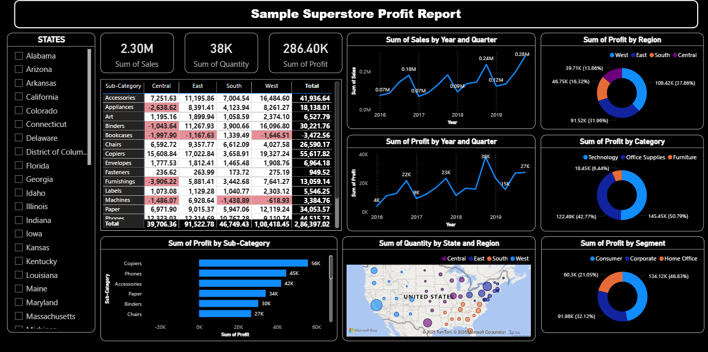
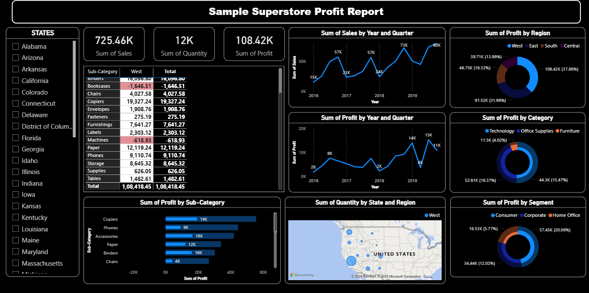
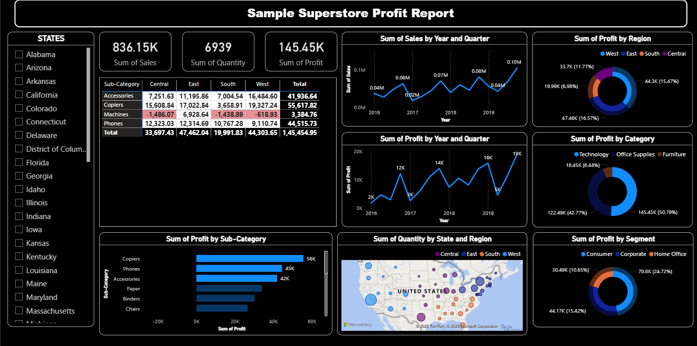

# 📊 Sample Superstore Profit Report – Power BI Dashboard

An interactive **Power BI dashboard** built using the *Sample Superstore* dataset to analyze **sales, profit, quantity, and regional performance** across multiple dimensions such as time, region, category, and customer segment.



---

## 🔍 Project Overview

This dashboard provides business insights by visualizing:
- Overall **Sales, Quantity, and Profit**
- Profit trends over **Year & Quarter**
- Regional and state-wise performance
- Category, sub-category, and segment profitability
- Identification of **loss-making sub-categories**

The report is designed to support **data-driven decision-making** for retail and sales analytics.

---

## 🛠️ Tools & Technologies

- **Power BI Desktop**
- **Sample Superstore Dataset**
- Microsoft Bing Maps (for geographic visualization)

---

## 📂 Project Structure


---

## 📈 Dashboard Features

### 🔢 Key Metrics
- **Total Sales:** 2.30M  
- **Total Quantity:** 38K  
- **Total Profit:** 286.40K  

### 📊 Visualizations Included
- Sales & Profit trends by **Year and Quarter**
- Profit distribution by **Region**
- Profit by **Category & Sub-Category**
- Profit by **Customer Segment**
- Quantity sold by **State & Region** (Map visualization)
- Dynamic **state-level filtering**

---

## 🧠 Key Insights

- **West region** contributes the highest share of profit  
- **Technology** category generates the most profit  
- **Copiers and Phones** are top-performing sub-categories  
- Some sub-categories (e.g., Tables, Bookcases) incur losses  
- **Consumer segment** leads in overall profitability  

---

## ▶️ How to Use

1. Download or clone the repository:
   ```bash
   git clone https://github.com/BirajDas27/Superstore-sales-report.git

2. Open Power BI Desktop
3. Load the file:
   Locate the file superstore sales report.pbix
4. click on open
5. Interact with filters and visual elements and slicers to explore insights

--

## 🖼️ Screenshots

### Profit by Region


### Profit by Category


### Profit by Customer Segment

